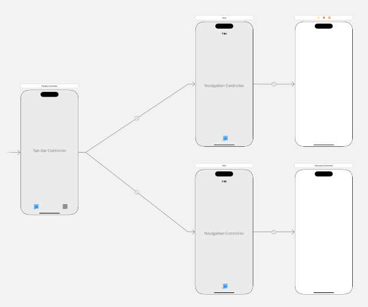
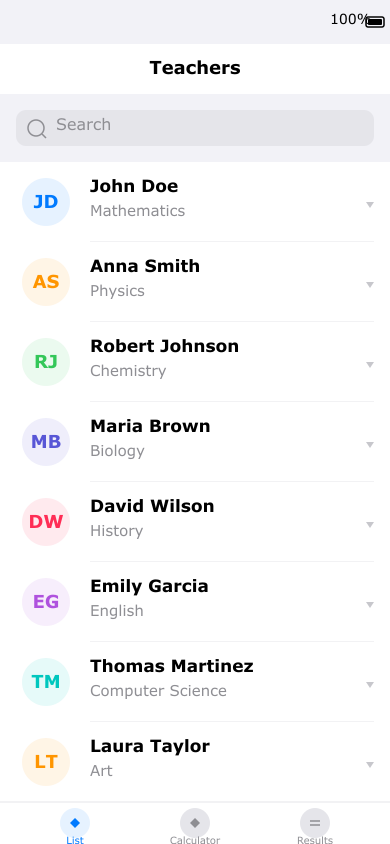
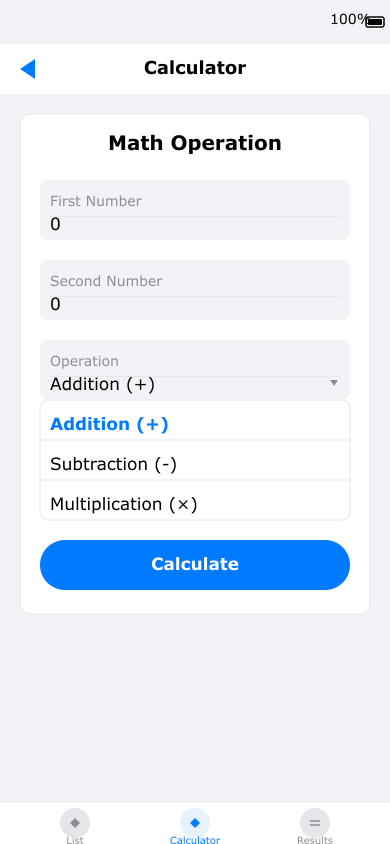
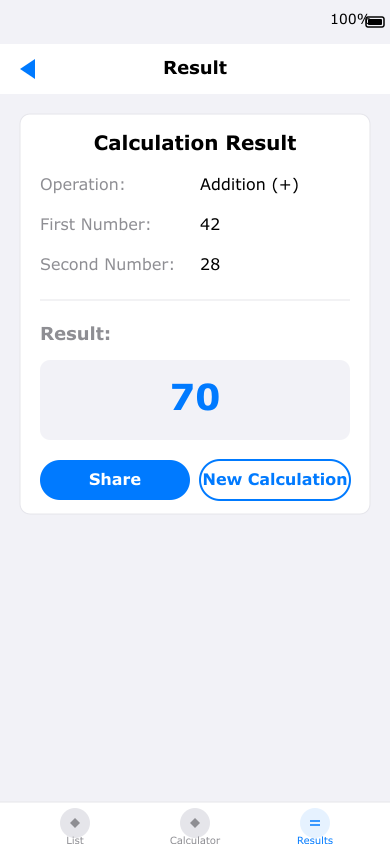

### Laboratorio Calificado 2

### En el siguiente Storyboard



### Implementar

#### 1.- Listar al ménos 8 docentes del departamento



#### 2.- Realizar la siguiente operación matemática

<p float="left">
  
  
</p>

## Implementación del Calculator - Paso a Paso

### Paso 1: Crear el modelo `Calculo.swift`
Este archivo define la lógica de cálculo y las operaciones disponibles:

```swift
class Calculo {
    enum Operacion: String {
        case suma = "Addition (+)"
        case resta = "Subtraction (-)"
        case multiplicacion = "Multiplication (×)"
    }
    
    let primerNumero: Double
    let segundoNumero: Double
    let operacion: Operacion
    var resultado: Double
    
    init(primerNumero: Double, segundoNumero: Double, operacion: Operacion) {
        self.primerNumero = primerNumero
        self.segundoNumero = segundoNumero
        self.operacion = operacion
        
        switch operacion {
        case .suma:
            self.resultado = primerNumero + segundoNumero
        case .resta:
            self.resultado = primerNumero - segundoNumero
        case .multiplicacion:
            self.resultado = primerNumero * segundoNumero
        }
    }
}
```

### Paso 2: Configurar la interfaz en Main.storyboard
1. Selecciona el **CalculatorController** en el storyboard
2. Agrega los siguientes elementos:
   - **Label**: "Math Operation" (título)
   - **TextField**: "First Number" (placeholder) con outlet `primerNumeroTextField`
   - **TextField**: "Second Number" (placeholder) con outlet `segundoNumeroTextField`
   - **Segmented Control**: Con 3 opciones (Addition, Subtraction, Multiplication) con outlet `operacionSegmentedControl`
   - **Button**: "Calculate" (azul) con outlet `calcularButton` y acción `calcularTapped:`

### Paso 3: Implementar `CalculatorController.swift`
Este controlador maneja la entrada de datos y realiza el cálculo:

```swift
class CalculatorController: UIViewController {
    
    @IBOutlet weak var primerNumeroTextField: UITextField?
    @IBOutlet weak var segundoNumeroTextField: UITextField?
    @IBOutlet weak var operacionSegmentedControl: UISegmentedControl?
    @IBOutlet weak var calcularButton: UIButton?
    
    var calculoActual: Calculo?

    override func viewDidLoad() {
        super.viewDidLoad()
        title = "Calculator"
        
        // Configurar valores por defecto
        primerNumeroTextField?.text = "0"
        segundoNumeroTextField?.text = "0"
    }
    
    @IBAction func calcularTapped(_ sender: UIButton) {
        guard let primerTexto = primerNumeroTextField?.text,
              let segundoTexto = segundoNumeroTextField?.text,
              let primerNum = Double(primerTexto),
              let segundoNum = Double(segundoTexto) else {
            return
        }
        
        let operacionIndex = operacionSegmentedControl?.selectedSegmentIndex ?? 0
        let operacion: Calculo.Operacion
        
        switch operacionIndex {
        case 0:
            operacion = .suma
        case 1:
            operacion = .resta
        case 2:
            operacion = .multiplicacion
        default:
            operacion = .suma
        }
        
        calculoActual = Calculo(primerNumero: primerNum, segundoNumero: segundoNum, operacion: operacion)
        
        // Navegar a resultados
        let resultadoViewController = ResultadoController()
        resultadoViewController.calculo = calculoActual
        navigationController?.pushViewController(resultadoViewController, animated: true)
    }
}
```

### Paso 4: Crear `ResultadoController.swift`
Este controlador muestra los resultados y permite compartir o hacer un nuevo cálculo:

```swift
class ResultadoController: UIViewController {
    
    @IBOutlet weak var operacionLabel: UILabel?
    @IBOutlet weak var primerNumeroLabel: UILabel?
    @IBOutlet weak var segundoNumeroLabel: UILabel?
    @IBOutlet weak var resultadoLabel: UILabel?
    @IBOutlet weak var compartirButton: UIButton?
    @IBOutlet weak var nuevoCalculoButton: UIButton?
    
    var calculo: Calculo?
    
    override func viewDidLoad() {
        super.viewDidLoad()
        title = "Result"
        
        guard let calculo = calculo else { return }
        
        operacionLabel?.text = calculo.operacion.rawValue
        primerNumeroLabel?.text = String(Int(calculo.primerNumero))
        segundoNumeroLabel?.text = String(Int(calculo.segundoNumero))
        resultadoLabel?.text = String(Int(calculo.resultado))
    }
    
    @IBAction func compartirTapped(_ sender: UIButton) {
        guard let calculo = calculo else { return }
        
        let mensaje = "\(Int(calculo.primerNumero)) + \(Int(calculo.segundoNumero)) = \(Int(calculo.resultado))"
        let actividadViewController = UIActivityViewController(activityItems: [mensaje], applicationActivities: nil)
        present(actividadViewController, animated: true)
    }
    
    @IBAction func nuevoCalculoTapped(_ sender: UIButton) {
        navigationController?.popViewController(animated: true)
    }
}
```

### Paso 5: Conectar en el Storyboard
- Crea una nueva escena con **ResultadoController** como Custom Class
- Agrega labels y botones con sus respectivos outlets
- Crea un **Navigation Controller** para manejar la navegación entre pantallas

### Flujo de la Aplicación
1. **Calculator**: Ingresa dos números, selecciona operación
2. **Calculate Button**: Crea instancia de `Calculo` y realiza operación
3. **Result**: Muestra resultado con opción de compartir o volver
